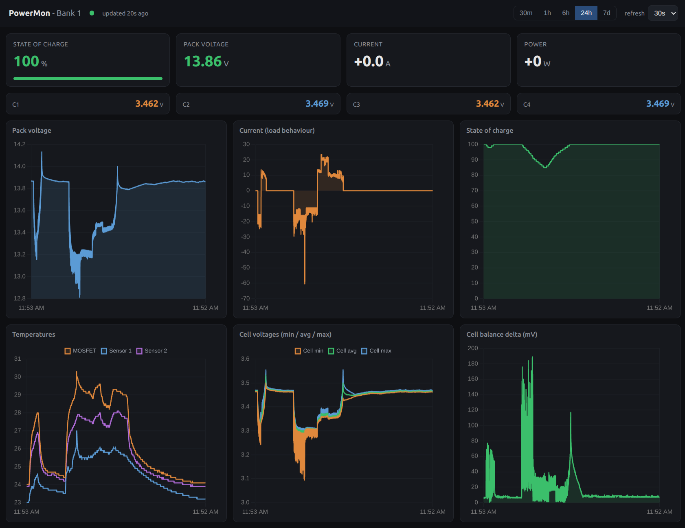

# PowerMon

Read live telemetry from a JK-BMS (JIKONG) battery over Bluetooth and watch it on a
local web dashboard. Pure Python, runs as a background service on Linux. It is
**read-only** - it never writes anything to the BMS.



Works with any JK-BMS that speaks the JK02_32S BLE protocol. The collector holds one
persistent BLE connection and decodes the cell-info stream; a tiny stdlib web server
serves the dashboard from the same data.

## Features

- Per-cell voltages, pack voltage, current, power, state of charge, temperatures,
  cycle count, and balance delta.
- Adaptive logging to SQLite - frequent under load, sparse when idle, and the load
  on/off edge is always captured.
- Runs unattended under systemd, reconnects on its own, and disconnects cleanly on stop
  so the phone app can take over the link.

## Supported hardware

JK-BMS (JIKONG) units using the **JK02_32S** BLE protocol. Tested on:

- JK-B2A8S30P (300 A)
- JK-B1A8S10P (100 A)

both on firmware 15.26 (BLE module BEKEN BK-BLE-1.0). Other JK models of the same
protocol generation are likely to work - the parser keys off the JK02_32S frame layout,
not a specific model. Older JK "JK02_24S" frames are not handled (the field offsets
shift by 32 bytes); adapting the parser is a small change.

Host: Linux with BlueZ (tested on Ubuntu), a Bluetooth adapter in range of the BMS,
Python 3.10 or newer.

## Requirements

```
pip install -r requirements.txt
```

One dependency: `bleak` (the BLE library). The web dashboard and `read.py` use only the
Python standard library.

## Install

```bash
git clone https://github.com/mudakisa/jk_bms_power_mon powermon
cd powermon
python3 -m venv .venv
. .venv/bin/activate
pip install -r requirements.txt
```

## Configure

Copy the config template and fill it in:

```bash
cp config.example.py config.py
```

Find your BMS address. Close the JK phone app first (the BMS allows only one BLE client),
then run:

```bash
python scan.py
```

It lists nearby BLE devices, flags the likely JK-BMS, and prints a line ready to paste:

```
    ("bank1", "AA:BB:CC:DD:EE:FF"),   # 314 A/h - PC
```

Put that address (and a database path) into `config.py`:

```python
DB = "powermon.db"
BANKS = [("bank1", "AA:BB:CC:DD:EE:FF")]
```

Tip: point `DB` at an SSD. On a spinning HDD the drive head clicks on every commit -
audible and pointless. The write volume is tiny (about 50 MB/day idle).

## Run

```bash
python collect.py        # start logging (Ctrl-C to stop - it disconnects cleanly)
python read.py           # one-shot read to the terminal (stop the collector first)
python web/web.py        # serve the dashboard at http://localhost:8080
```

Open http://localhost:8080.

## Run as a service (optional)

`systemd/` has user units for the collector and the web server. In both files, replace the
placeholder `/path/to/powermon` with your actual clone path (the collector unit also expects
a `.venv` there - the one you created in Install), then:

```bash
cp systemd/powermon.service systemd/powermon-web.service ~/.config/systemd/user/
systemctl --user daemon-reload
systemctl --user enable --now powermon.service powermon-web.service
loginctl enable-linger "$USER"   # start at boot without an active login session
```

`start.sh` and `stop.sh` resume and pause the collector - handy when you want to connect
with the phone app, since the BMS only talks to one client at a time. `dashboard.sh`
opens the web dashboard.

## Safety

PowerMon is read-only. It sends exactly two BLE commands - "send device info" (`0x97`)
and "send cell info" (`0x96`) - and never writes a setting to the BMS. It does not touch
charge, discharge, balancing, or protection thresholds; the BMS handles all of that.
Monitoring a pack cannot harm it. If you extend the project, keep it that way: a wrong
settings-write to a BMS managing a large pack is not a cheap mistake.

## How the protocol works (JK02_32S)

Useful if you want to adapt or extend it.

- Comms characteristic: service `0xffe0`, characteristic `0xffe1` (write + notify).
- Command frame, 20 bytes: `AA 55 90 EB <cmd> 00 <val> 00..00 <crc>`, where
  `crc = sum(bytes[0:19]) & 0xFF`. `0x97` = device info, `0x96` = cell info. Send
  device-info first, then cell-info, to start the stream - cell-info alone does not start it.
- After that the BMS streams cell-info frames on its own at about 1 Hz. No polling needed,
  which is also why there is no per-command beep once connected.
- Response frames start with `55 AA EB 90 <type>`, are 300 bytes, and arrive split across
  ~20-byte BLE notifications, so you reassemble them. Type `0x02` is cell-info. CRC is the
  last byte, `sum(bytes[0:299]) & 0xFF`.
- Gotcha: scan for all `55 AA EB 90` headers in the buffer - the first is usually a
  device-info (`0x03`) frame, not the cell-info you want.
- The standard BLE Battery Level characteristic (`0x2a19`) reads 0 on these units; ignore
  it and use the frame.
- Field offsets are in `jkbms.parse_cell_info`, verified against real values.

`scan.py`, `gatt.py`, `probe.py`, `capture.py`, and `test_stream.py` are the recon scripts
this was worked out with - kept in the repo, handy if you port to another model.

## A second bank

A single Bluetooth adapter cannot reliably hold two BMS connections at once - their
discovery sessions collide. For two banks, use a second adapter or an ESP32 BLE bridge,
then add the second entry to `BANKS` in `config.py`.

## Project layout

```
jkbms.py        protocol parser + read_cell_info() - the reusable core
collect.py      collector daemon (BLE stream -> SQLite)
read.py         one-shot terminal read
web/            built-in dashboard (stdlib server + Chart.js)
config.example.py   copy to config.py and edit
systemd/        service units
*.sh            start / stop / dashboard helpers
scan/gatt/probe/capture/test_stream .py   protocol recon scripts
```

## License

MIT. Do whatever you want with it. See `LICENSE`.
