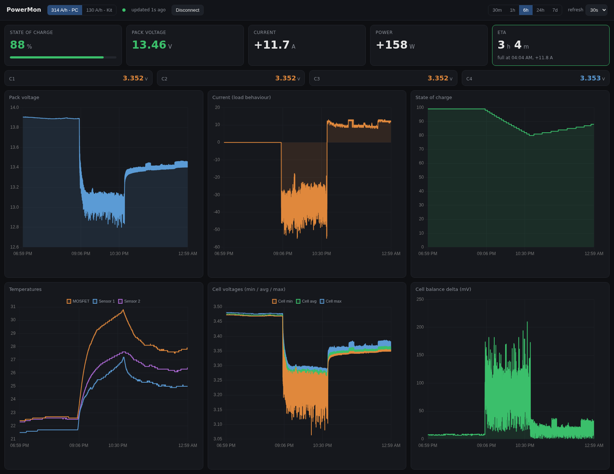
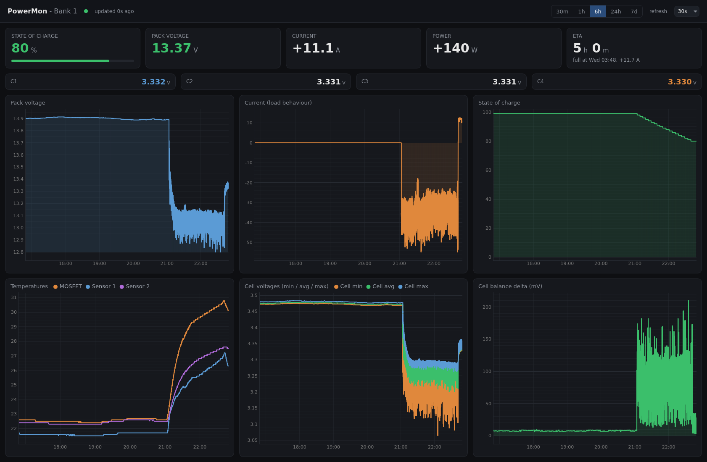

# PowerMon

Read live telemetry from a JK-BMS (JIKONG) battery over Bluetooth and watch it on a
local web dashboard, or in a native desktop app on Linux. Pure Python, runs as a
background service on Linux. It is **read-only** - it never writes anything to the BMS.



Works with any JK-BMS that speaks the JK02_32S BLE protocol. The collector holds one
persistent BLE connection and decodes the cell-info stream; a tiny stdlib web server
serves the dashboard from the same data, and the desktop app reads it directly.

## Features

- Per-cell voltages, pack voltage, current, power, state of charge, temperatures,
  cycle count, and balance delta.
- Several banks on one Bluetooth adapter. Switch between them in the dashboard header;
  Disconnect frees one bank's link for the phone app, Connect takes it back.
- Time left at the current load: to empty while discharging, to full while charging.
  The load is the mean current over the last 5 minutes; the charge left comes from the
  BMS's own counter.
- Adaptive logging to SQLite - frequent under load, sparse when idle, and the load
  on/off edge is always captured.
- Runs unattended under systemd, reconnects on its own, and disconnects cleanly on stop
  so the phone app can take over the link.

## Supported hardware

JK-BMS (JIKONG) units using the **JK02_32S** BLE protocol. Tested on:

- JK-B2A8S30P (300 A)
- JK-B1A8S10P (100 A)

both on firmware 15.26 (BLE module BEKEN BK-BLE-1.0). Other JK models of the same
protocol generation are likely to work - the parser keys off the JK02_32S frame layout,
not a specific model. Older JK "JK02_24S" frames are not handled (the field offsets
shift by 32 bytes); adapting the parser is a small change.

Host: Linux with BlueZ (tested on Ubuntu), a Bluetooth adapter in range of the BMS,
Python 3.10 or newer.

## Requirements

```
pip install -r requirements.txt
```

One dependency: `bleak` (the BLE library). The web dashboard and `read.py` use only the
Python standard library.

The desktop app is optional and Linux-only. It needs PySide6 (Qt), pyqtgraph and numpy:

```
pip install -r requirements-app.txt
```

## Install

```bash
git clone https://github.com/mudakisa/jk_bms_power_mon powermon
cd powermon
python3 -m venv .venv
. .venv/bin/activate
pip install -r requirements.txt
```

## Configure

Copy the config template and fill it in:

```bash
cp config.example.py config.py
```

Find your BMS address. Close the JK phone app first (the BMS allows only one BLE client),
then run:

```bash
python scan.py
```

It lists nearby BLE devices, flags the likely JK-BMS, and prints a line ready to paste:

```
    ("bank1", "AA:BB:CC:DD:EE:FF"),   # 314 A/h - PC
```

Put that address (and a database path) into `config.py`:

```python
DB = "powermon.db"
BANKS = [("bank1", "AA:BB:CC:DD:EE:FF")]
```

An optional third field is the name shown on the bank's button in the dashboards:
`("bank1", "AA:BB:CC:DD:EE:FF", "House")`. Without it the button shows `bank1`.

Tip: an SSD makes a good home for the DB - the frequent small commits stay quiet and cause
no mechanical wear. On some spinning HDDs the head clicks audibly on each commit (others are
fine). Write volume is tiny, about 50 MB/day idle.

## Run

```bash
python collect.py        # start logging (Ctrl-C to stop - it disconnects cleanly)
python read.py           # one-shot read to the terminal (stop the collector first)
python web/web.py        # serve the dashboard at http://localhost:8080
python app/powermon_app.py   # or open the desktop app (Linux)
```

Open http://localhost:8080.

## Run as a service (optional)

`systemd/` has user units for the collector and the web server. In both files, replace the
placeholder `/path/to/powermon` with your actual clone path (the collector unit also expects
a `.venv` there - the one you created in Install), then:

```bash
cp systemd/powermon.service systemd/powermon-web.service ~/.config/systemd/user/
systemctl --user daemon-reload
systemctl --user enable --now powermon.service powermon-web.service
loginctl enable-linger "$USER"   # start at boot without an active login session
```

`start.sh` and `stop.sh` resume and pause the collector - handy when you want to connect
with the phone app, since the BMS only talks to one client at a time. To free just one
bank, use Disconnect in the dashboard header instead; the collector keeps the others. `dashboard.sh`
opens the web dashboard.

## Desktop app (Linux, optional)

The same dashboard in a native window: no browser, no port. It reads the collector's
database directly, so it does not need `powermon-web.service`. The web dashboard stays
for every other platform, and both show the same numbers.



```bash
pip install -r requirements-app.txt
python app/powermon_app.py
```

It lives in the tray: it starts there, minimizing sends it back, and launching it again
opens the running window instead of a second copy. The tray menu lists the banks with
their charge; click one to open its page. Double-click the icon to show / hide the window. On GNOME the tray needs the AppIndicator extension (enabled by default on Ubuntu);
without a tray the window simply opens.

To put it in the application menu, install the launcher. Like the systemd units, it
carries a `/path/to/powermon` placeholder; run this from your clone:

```bash
sed "s|/path/to/powermon|$PWD|g" app/powermon.desktop > ~/.local/share/applications/powermon.desktop
```

## Safety

PowerMon is read-only. It sends exactly two BLE commands - "send device info" (`0x97`)
and "send cell info" (`0x96`) - and never writes a setting to the BMS. It does not touch
charge, discharge, balancing, or protection thresholds; the BMS handles all of that.
Monitoring a pack cannot harm it. If you extend the project, keep it that way: a wrong
settings-write to a BMS managing a large pack is not a cheap mistake.

## How the protocol works (JK02_32S)

Useful if you want to adapt or extend it.

- Comms characteristic: service `0xffe0`, characteristic `0xffe1` (write + notify).
- Command frame, 20 bytes: `AA 55 90 EB <cmd> 00 <val> 00..00 <crc>`, where
  `crc = sum(bytes[0:19]) & 0xFF`. `0x97` = device info, `0x96` = cell info. Send
  device-info first, then cell-info, to start the stream - cell-info alone does not start it.
- After that the BMS streams cell-info frames on its own at about 1 Hz. No polling needed,
  which is also why there is no per-command beep once connected.
- Response frames start with `55 AA EB 90 <type>`, are 300 bytes, and arrive split across
  ~20-byte BLE notifications, so you reassemble them. Type `0x02` is cell-info. CRC is the
  last byte, `sum(bytes[0:299]) & 0xFF`.
- Gotcha: scan for all `55 AA EB 90` headers in the buffer - the first is usually a
  device-info (`0x03`) frame, not the cell-info you want.
- The standard BLE Battery Level characteristic (`0x2a19`) reads 0 on these units; ignore
  it and use the frame.
- Field offsets are in `jkbms.parse_cell_info`, verified against real values.

`scan.py`, `gatt.py`, `probe.py`, `capture.py`, and `test_stream.py` are the recon scripts
this was worked out with - kept in the repo, handy if you port to another model.

## A second bank

Add it to `BANKS` in `config.py` and restart the collector. One adapter holds both links.
What collides is the adapter's single discovery session, so the collector finds and
connects banks one at a time, and reconnects to a bank BlueZ still remembers without
scanning at all. Tested with two banks on one USB adapter, one of them at -83 dBm.

Pausing a bank from a dashboard writes its id to `<db name>.paused.json` next to the DB;
the collector checks it every second, drops that link, and reconnects once it is removed.

## Project layout

```
jkbms.py        protocol parser + read_cell_info() - the reusable core
collect.py      collector daemon (BLE stream -> SQLite)
readings.py     DB queries + time-left estimate, shared by the web and desktop dashboards
read.py         one-shot terminal read
web/            built-in dashboard (stdlib server + Chart.js)
app/            desktop app for Linux (PySide6 + pyqtgraph) and its menu launcher
config.example.py   copy to config.py and edit
systemd/        service units
*.sh            start / stop / dashboard helpers
scan/gatt/probe/capture/test_stream .py   protocol recon scripts
```

## License

MIT. Do whatever you want with it. See `LICENSE`.
